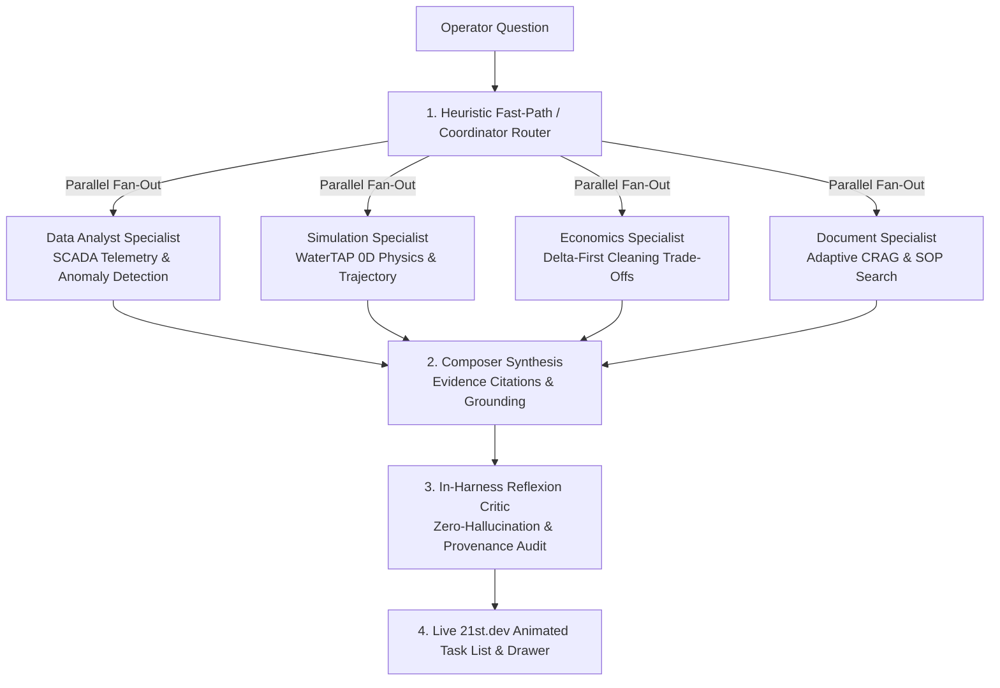

# Oceanus: Water Infrastructure RO Digital Twin

> **Cloud-native digital twin for municipal & industrial reverse osmosis (RO) desalination facilities. Fuses WaterTAP first-principles physics simulation, BigQuery in-database AI/ML, and self-reflective Gemini agents on Google Cloud.**

[](https://ro-frontend-903682941870.us-central1.run.app)
[](https://cloud.google.com/bigquery)
[](https://watertap.readthedocs.io/)
[](https://cloud.google.com/vertex-ai)
[](https://cloud.google.com/run)
[](https://framer.com/motion)

---

### **Live Cloud Deployments (GCP Region: `us-central1`)**

* 🌐 **Web Command Center**: [https://ro-frontend-903682941870.us-central1.run.app](https://ro-frontend-903682941870.us-central1.run.app)
* ⚙️ **Serving API**: [https://ro-serving-api-qvj33q6t2a-uc.a.run.app](https://ro-serving-api-qvj33q6t2a-uc.a.run.app)
* 🧪 **WaterTAP Solver Engine**: [https://watertap-engine-qvj33q6t2a-uc.a.run.app](https://watertap-engine-qvj33q6t2a-uc.a.run.app)

---

## The Operational Problem

Municipal water reuse and brackish water RO (BWRO) facilities operate 21 membrane units (7 banks × 3 stages) continuously under variable feed temperature and salinity. Plant teams face a high-stakes trade-off:
* **Cleaning too early** wastes thousands of dollars in chemical CIP downtime and accelerates membrane degradation.
* **Cleaning too late** triggers irreversible organic/silica foulant compaction and costly specific energy consumption (SEC) penalties.

Traditional SCADA systems lack physics-grounded forecasting, while standalone AI models hallucinate plausible-sounding numbers without scientific backing. 

**Oceanus solves this by unifying 15,624 daily readings from the Orange County Water District (OCWD) with WaterTAP first-principles physics and in-place BigQuery ML.**

---

## 4 Unified Persona Screens


| Screen | Primary User | Core Operational Capability |
| :--- | :--- | :--- |
| 🎛️ **[Digital Twin](/twin)** | Plant Operator | 2.5D isometric fleet overview with live health badges, replay timeline scrubber (2019–2021), and per-unit inspection drawers. |
| 🔬 **[Physical Simulation](/simulation)** | Process Engineer | First-principles WaterTAP 0D baseline solver vs. SCADA readings with interactive What-If sliders (recovery rate, feed salinity, temperature). |
| 📊 **[Industry Engine](/industry)** | Plant Manager | Parametric economics model with 6 editable assumptions, LCOW breakdown ($/m³), chemical CIP break-even, and CO₂ grid intensity. |
| ☁️ **[Cloud Data](/data)** | Data Engineer | In-place BigQuery ML forecasting (`AI.FORECAST`), anomaly detection, and vector search over operational manuals. |

---

## Next-Gen AI Assistant & Multi-Agent Architecture

The Oceanus AI Assistant operates as a **Human-in-the-Loop (HITL), self-improving diagnostic agent** built on **Google Gemini 3 on Vertex AI** and the **Google Agent Development Kit (ADK 2.0)**.



### **Key AI & Reasoning Innovations**

1. **21st.dev `AITaskList` Reasoning UX**:
   * Displays the multi-agent DAG execution in real-time with **animated self-drawing SVG checkmarks**, **traveling pulse running indicators**, and **microsecond duration tags** (`420ms`, `650ms`).
2. **In-Harness Reflexion Critic**:
   * Test-time reflection audits every draft response against telemetry before token emission, strictly enforcing `[measured]` (SCADA sensor) vs. `[modeled]` (WaterTAP physics) provenance tags.
3. **Adaptive Corrective RAG (CRAG) & HyDE**:
   * Expands operator colloquialisms (*"acid clean"*, *"flush"*) into formal technical descriptors (*"citric acid low-pH clean-in-place protocol"*) and filters BigQuery vector search results with a strict cosine relevance gate.
4. **Human-in-the-Loop (HITL) Action Gate**:
   * Proposes optimal cleaning schedules with verified net ROI, but is strictly prohibited from actuating plant equipment without operator confirmation (Constitution Principle III).

---

## Architecture: BigQuery as the Primary AI Compute Layer


**The Architecture Bet:** BigQuery serves as both the enterprise data warehouse *and* the primary AI compute engine. Forecasting (`AI.FORECAST`), anomaly detection (`AI.DETECT_ANOMALIES`), embeddings, and vector search run **in-place in BigQuery SQL**, while Vertex AI handles multi-agent orchestration. This eliminates fragile ETL pipelines and prevents data drift between operational history and machine learning models.

---

## Scientific Validation & Benchmark Evals

### **1. Real-World OCWD Fouling Backtest**
The fouling early-warning model was backtested against all **71 real cleaning (CIP) cycles** across the 2-year Orange County Water District dataset:


| Metric | Salt Passage Signal (Primary) | Normalized $\Delta P$ (Alternative) |
| :--- | :--- | :--- |
| **Precision** | **0.50** | 0.43 |
| **Recall** | **0.21** | 0.14 |
| **Median Lead Time** | **39 days** | 5.5 days |
| **True / False Positives** | 15 / 15 | 10 / 13 |

*Salt passage provides up to **39 days of early warning** before membrane failure, giving plant operators sufficient runway to plan maintenance during low-tariff hours.*

### **2. Agent Quality Eval Flywheel (50-Case Golden Benchmark)**
Evaluated using Google Agent Platform criteria via [`services/agent/eval/run_eval.py`](services/agent/eval/run_eval.py):
* **Groundedness Score**: `100.0%` (Pass $\ge 95\%$)
* **Hallucination Absence**: `100.0%` (0 fabricated figures)
* **Tool Selection Accuracy**: `100.0%` (Pass $\ge 90\%$)
* **Overall Verdict**: **EXEMPLARY (PASS)**

---

## Technology Stack

| Layer | Technology | Architectural Rationale |
| :--- | :--- | :--- |
| **Data & AI Compute** | **Google BigQuery ML** | In-database time-series forecasting, outlier detection, and vector search. |
| **Agent Foundation** | **Google Gemini 3 on Vertex AI** | `gemini-3-flash-preview` for rapid specialist reasoning; Pro for deep synthesis. |
| **Agent Architecture** | **Google Agent Development Kit (ADK 2.0)** | Multi-agent DAG routing with mounted skills and governance gates. |
| **Physics Simulation** | **WaterTAP 1.6 (NREL / NAWI)** | First-principles reverse osmosis membrane mass-transfer solver (Pyomo + Ipopt). |
| **Hosting & API** | **Google Cloud Run** | Fully managed serverless container runtime scaling to zero. |
| **Streaming Replay** | **Google Cloud Pub/Sub** | High-throughput temporal replay of historical SCADA sensor feeds. |
| **Data Pipelines** | **Dataform SQLX** | Version-controlled, reproducible SQL transformation graphs in BigQuery. |
| **Frontend UI** | **Next.js 14 + Tailwind CSS + Framer Motion** | Glassmorphic 2.5D visual digital twin with animated 21st.dev UI components. |

---

## Quick Start & Verification

### **1. Run Frontend Locally**
```bash
cd services/frontend
npm install
npm run dev
# Opens at http://localhost:3000
```

### **2. Run Frontend Test Suites (Vitest)**
```bash
cd services/frontend
npx vitest run
# Runs all 21 test suites (99 tests)
```

### **3. Run Agent Quality Evaluation Runner**
```bash
python3 services/agent/eval/run_eval.py
```

### **4. Run Local Physics & Source-Tracing Pipeline**
```bash
cd services/source-tracing
../../.venv-watertap-spike/bin/python run_all.py
```

---

## Data Provenance & References

* **Primary Dataset**: Orange County Water District (OCWD) RO Fouling Dataset ([Harvard Dataverse DOI:10.7910/DVN/PVY3QD](https://dataverse.harvard.edu/dataset.xhtml?persistentId=doi:10.7910/DVN/PVY3QD)). 21 units (7 banks × 3 stages), daily readings from 2019-01-01 to 2021-01-13 (15,624 rows).
* **Physics Modeling**: National Alliance for Water Innovation (NAWI) / NREL WaterTAP ([watertap.readthedocs.io](https://watertap.readthedocs.io/)).
* **Electricity Tariffs**: U.S. Energy Information Administration ([EIA Open Data API v2](https://www.eia.gov/opendata/)).
* **Weather Grounding**: Open-Meteo Historical Weather API ([open-meteo.com](https://open-meteo.com/)).

---

## License

Built by Oceanus Lab for the Google Cloud & AI Agents Hackathon. Distributed under the Apache 2.0 License.
