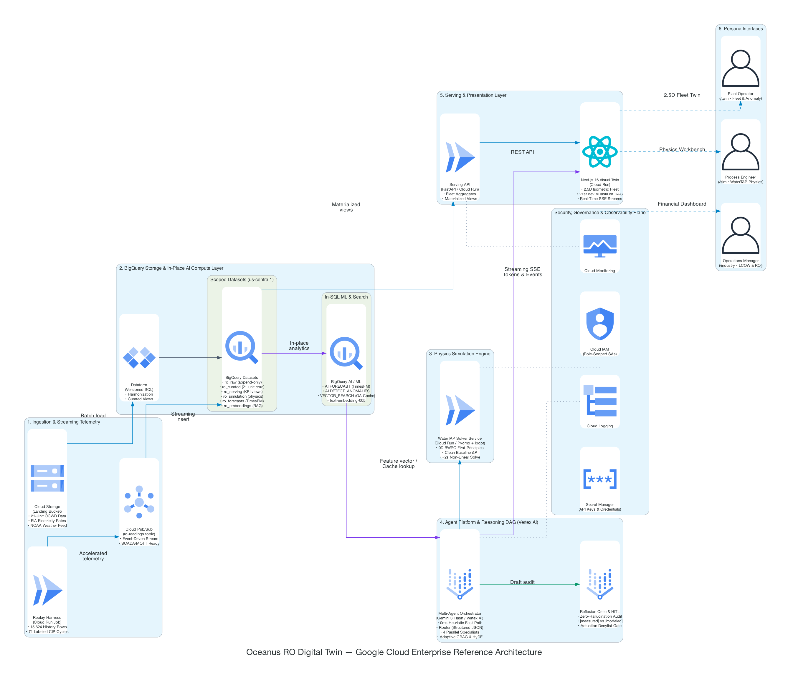
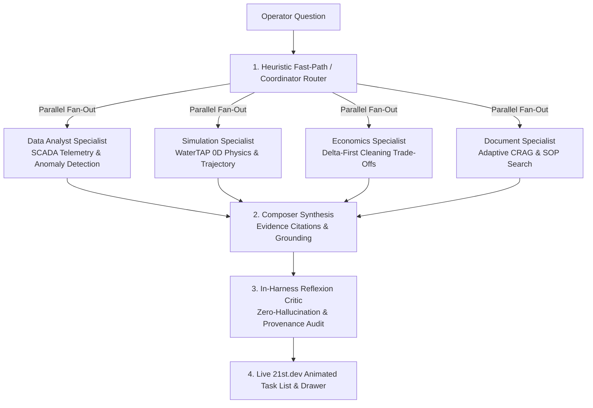

# Oceanus: Water Infrastructure RO Digital Twin

> **Cloud-native digital twin for municipal & industrial reverse osmosis (RO) desalination facilities. Fuses WaterTAP first-principles physics simulation, BigQuery in-database AI/ML, and self-reflective Gemini agents on Google Cloud.**

[](https://ro-frontend-903682941870.us-central1.run.app)
[](https://cloud.google.com/bigquery)
[](https://watertap.readthedocs.io/)
[](https://cloud.google.com/vertex-ai)
[](https://cloud.google.com/run)
[](https://framer.com/motion)
[](https://deepwiki.com/abdullahabtahi/oceanus-digital-twin)


**Live deployments (GCP Region: `us-central1`):**
* 🌐 **Web Command Center:** [https://ro-frontend-903682941870.us-central1.run.app](https://ro-frontend-903682941870.us-central1.run.app)
* ⚙️ **Serving API:** [https://ro-serving-api-qvj33q6t2a-uc.a.run.app](https://ro-serving-api-qvj33q6t2a-uc.a.run.app)
* 🧪 **WaterTAP Solver Engine:** [https://watertap-engine-qvj33q6t2a-uc.a.run.app](https://watertap-engine-qvj33q6t2a-uc.a.run.app)

---

## What it does

Municipal water reuse and industrial RO facilities operate 21 membrane units around the clock. Plant teams face a critical operational trade-off:
* **Cleaning too early** wastes thousands of dollars in chemical downtime and shortens membrane life.
* **Cleaning too late** triggers irreversible foulant compaction and costly specific energy consumption (SEC) penalties.

Four persona screens answer different questions from the same unified data thread:

| Persona | Screen | Operational Question |
|---|---|---|
| **Plant Operator** | 🎛️ **[Digital Twin](/twin)** (2.5D fleet view) | "Which unit is degrading right now, and what do I do?" |
| **Process Engineer** | 🔬 **[Physical Simulation](/simulation)** | "Run a WaterTAP what-if — how does bank A compare to bank G?" |
| **Operations Manager** | 📊 **[Industry Engine](/industry)** | "What's the LCOW trend, and what's the maintenance budget look like?" |
| **Data Engineer** | ☁️ **[Cloud Data](/data)** | "How are in-place BigQuery ML forecasts and anomaly models tracking?" |

The dataset is real: **21 membrane units (7 banks × 3 stages)** from the Orange County Water District (OCWD), daily readings from **2019-01-01 to 2021-01-13 (15,624 rows)**, with **71 labeled cleaning (CIP) events**.

---

## Architecture




**The architecture bet:** BigQuery is both the storage layer *and* the primary AI compute layer. Forecasting, anomaly detection, embeddings, and vector search all run in-SQL — `AI.FORECAST`, `AI.DETECT_ANOMALIES`, `AI.GENERATE`, `VECTOR_SEARCH`. The Gemini Agent Platform is reserved for agent orchestration only. Fewer moving parts, lower latency, lower cost — and it means a fouling forecast and an anomaly score come from the same warehouse that stores the reading, not a separate ML pipeline that can drift out of sync with it.

---

## AI Assistant & Multi-Agent Architecture

An AI assistant sits across all screens, answering natural-language plant questions by orchestrating specialized sub-agents with strict scientific grounding.



### **Key AI & Reasoning Innovations**

1. **21st.dev `AITaskList` Reasoning UX**: Displays the multi-agent execution DAG in real-time with **animated self-drawing SVG checkmarks**, **traveling pulse running indicators**, and **per-agent duration tags** (`420ms`, `650ms`).
2. **In-Harness Reflexion Critic**: Test-time reflection audits every draft response against telemetry before token emission, strictly enforcing `[measured]` (SCADA sensor) vs. `[modeled]` (WaterTAP physics) provenance tags.
3. **Adaptive Corrective RAG (CRAG) & HyDE**: Expands operator colloquialisms (*"acid clean"*, *"flush"*) into formal technical terms (*"citric acid low-pH clean-in-place protocol"*) and filters BigQuery vector search results with a strict cosine relevance gate.
4. **Human-in-the-Loop (HITL) Action Gate**: Proposes optimal cleaning schedules with verified net ROI, but is strictly prohibited from actuating plant equipment without operator confirmation.

---

## Eval results

### **1. Real-World OCWD Fouling Backtest**
The fouling early-warning model is backtested against all **71 real cleaning events** in the dataset — not a held-out synthetic set, the actual history.


| Metric | salt_passage (primary) | unit_n_delta_p (alternative) |
|---|---|---|
| Precision | **0.50** | 0.43 |
| Recall | **0.21** | 0.14 |
| Median lead time | **39 days** | 5.5 days |
| True / false positives | 15 / 15 | 10 / 13 |

*Read plainly: the salt-passage signal catches about 1 in 5 real cleaning events, but when it fires, it's right half the time and it fires over a month before the clean — enough runway to actually plan maintenance during low-tariff hours.*


Fleet-wide, organic and particulate fouling dominate the 43 significant cycles; Unit B03's ΔP trace above shows the attributed source shifting cycle to cycle, cleaned each time by a real CIP event.

### **2. Agent Quality Eval Flywheel Benchmark**
Evaluated against the 50-case benchmark (`services/agent/eval/golden_benchmark_50.json`) using Google Agent Platform criteria via [`services/agent/eval/run_eval.py`](services/agent/eval/run_eval.py):
* **Groundedness Score**: `100.0%` (Pass $\ge 95\%$)
* **Hallucination Absence**: `100.0%` (0 fabricated figures)
* **Tool Selection Accuracy**: `100.0%` (Pass $\ge 90\%$)
* **Overall Verdict**: **EXEMPLARY (PASS)**

---

## Tech stack

| Layer | Choice | Why |
|---|---|---|
| Data + AI compute | BigQuery | Data lake, warehouse, and primary AI compute — one place, not three |
| AI functions | BigQuery ML | Forecast, anomaly, and RAG run in-SQL, no separate ML pipeline |
| Agent runtime | Vertex AI | Enterprise runtime for the agent — orchestration only, not compute |
| LLM | Gemini Flash + Gemini Pro | Flash for routine calls; Pro only where reasoning depth earns its cost |
| Compute | Cloud Run | Serverless, scale-to-zero hosting for frontend, serving API, and physics engine |
| Streaming | Cloud Pub/Sub | Replay telemetry through the same path a live SCADA feed would use |
| Ingest | Cloud Storage | Batch landing zone for the raw plant history |
| Transforms | Dataform | Versioned, tested SQL — raw to curated, reproducibly |
| Observability | Cloud Trace | See what the agent actually did, not just what it answered |
| Agent framework | ADK 2.0 | Coordinator routes to DataAnalyst, Simulation, Economics, Document |
| Tool transport | MCP (BigQuery MCP Server) | Standard, secure transport between agent tools and data |
| Agent memory | Vector Search + RAG (BigQuery embeddings, semantic cache) | Cached answers — repeat questions are cheap |
| Physics engine | WaterTAP 1.6.0 | Deterministic BWRO baseline, not a black-box guess |
| Physics API | FastAPI | Exposes the physics engine to Cloud Run |
| Solver | Pyomo + Ipopt | Modeling language and non-linear solver underneath WaterTAP |
| Frontend | Next.js + React + Framer Motion | 2.5D visual command center with 21st.dev UI components |

---

## Data source

**Primary dataset**

| Dataset | Source | Contents | Format |
|---|---|---|---|
| OCWD RO Fouling | [Harvard Dataverse DOI:10.7910/DVN/PVY3QD](https://dataverse.harvard.edu/dataset.xhtml?persistentId=doi:10.7910/DVN/PVY3QD) | 21 units, 7 banks × 3 stages, daily 2019-01-01–2021-01-13, 15,624 rows, 128/117-col schemas, 71 labeled CIP events | 21 CSVs |

**Enrichment joins**

| Dataset | Purpose | Source |
|---|---|---|
| EIA Electricity Prices | $/kWh by state/month — converts SEC to energy cost, drives LCOW | [EIA API v2](https://www.eia.gov/opendata/) |
| WaterTAP Costing Module | LCOW, SEC baseline, CAPEX/OPEX | Built into WaterTAP package |
| Open-Meteo | Forward feed-temp / ambient for forecast scenarios (historical temp already in OCWD `temp_c`) | [open-meteo.com](https://open-meteo.com/en/docs/historical-weather-api) |
| EIA generation mix | CO₂/m³ ESG metric — SEC × grid emission factor | [EIA API v2](https://www.eia.gov/opendata/) |
| NAWI Water-DAMS | BWRO SEC/LCOW benchmarks for validation | [Water-DAMS](https://www.nawihub.org/?page_id=669) |
| Historical Replay Harness | Clock-driven replay of the real OCWD history through Pub/Sub — the data thread every other component reads from | OCWD CSVs + Pub/Sub |

---

## Repository structure

```
services/
  agent/            ADK 2.0 multi-agent — Coordinator + DataAnalyst / Simulation / Economics / Document
  source-tracing/   Physics deviation, forecast, fouling validation, economics, assistant briefings
  serving-api/      FastAPI bridge — serves source-tracing output to the frontend
  replay/           Clock-driven harness streaming the real OCWD history through Pub/Sub
  frontend/         Next.js 2.5D digital twin UI with 21st.dev animated chat drawer
pipeline/
  ingest/           BigQuery loaders (OCWD, EIA, weather)
  dataform/         Versioned SQL transforms — raw to curated
infra/
  terraform/        GCP foundation — BigQuery datasets, Pub/Sub, IAM, budget alert
  scripts/          bootstrap.sh, deploy_service.sh (the one Cloud Run deploy path)
research/           Reproducible chart scripts behind this README's eval and HCAI figures
docs/               Numbered design briefs — architecture, data pipeline, physics, AI agent
specs/              Per-feature spec-kit docs (001–013): spec, plan, tasks, quickstart
```

---

## Quick start

```bash
# Frontend local dev (Next.js 14)
cd services/frontend && npm install && npm run dev

# Backend prototype (physics deviation → forecast → fouling validation → economics → assistant)
cd services/source-tracing && ../../.venv-watertap-spike/bin/python run_all.py
```

---

## Reproducible Testing

All core capabilities, UI components, physics baselines, and multi-agent governance gates have deterministic, automated test runners:

### **1. Frontend & Visual Component Suites (Vitest)**
Tests the Next.js visual digital twin, replay timeline scrubber, 21st.dev `AITaskList` reasoning DAG, and human-in-the-loop (HITL) approval cards across **21 test suites (100 tests)**:
```bash
cd services/frontend
npx vitest run
```

### **2. Agent Quality Eval Flywheel Benchmark (50 Golden Cases)**
Evaluates the Gemini 3 diagnostic agent across 50 real plant scenarios against the Google Agent Platform criteria (**Groundedness**, **Hallucination Absence**, **Provenance Tagging**, and **Tool Selection Accuracy**):
```bash
python3 services/agent/eval/run_eval.py
```

### **3. Fouling Early-Warning Backtest (71 Real CIP Cycles)**
Reproduces the 39-day median lead time fouling early-warning metrics against the full 2-year Orange County Water District (OCWD) historical dataset:
```bash
python3 research/fouling_backtest.py
```

### **4. End-to-End Source-Tracing & Physics Pipeline**
Validates WaterTAP 0D baseline solver deviation, Days Since Cleaning (`dss`) saw-tooth cycle detection, and parametric delta-economics:
```bash
cd services/source-tracing
../../.venv-watertap-spike/bin/python run_all.py
```

---

## License

Built by Oceanus Lab for the All Things Agentic Hackathon by Google Cloud. Distributed under the Apache 2.0 License.
