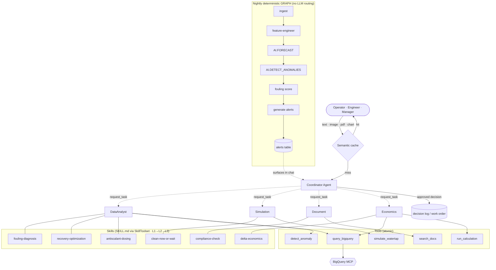

# AI Agent Architecture — ADK + Gemini Enterprise
**Brief for:** ADK agent implementation, Memory Bank config, RAG setup, tool manifest, eval  
**Feeds into:** Agent coding agent, Gemini Enterprise Agent Platform setup

---

## Stack

| Component | Technology |
|---|---|
| Agent framework | **ADK 2.0** (Python) |
| Runtime | **Gemini Enterprise Agent Platform — Agent Runtime** (serverless managed) |
| Foundation model | **Gemini Flash** (default); route to Pro for complex multi-step reasoning |
| Conversation state | **Sessions** (managed by Agent Runtime) |
| Long-term memory | **Memory Bank** (operator preferences, plant-specific facts, incident history) |
| Agent evaluation | **Example Store + Evaluation Service** (`adk eval`) |
| Safe code execution | **Code Execution sandbox** (for ad-hoc economic calculations) |
| Data integration | **BigQuery MCP server** (exposes BQ to agent via MCP protocol) |
| Procedural knowledge | **Agent Skills** (`SkillToolset`, SKILL.md, progressive disclosure) |
| Latency | **Context caching** (native, `ContextCacheConfig`) + **semantic caching** (custom, Vector Search) |
| Governance | **Plugins + callbacks** (anti-hallucination, HITL gates) · **Cloud Trace** · **BQ Agent Analytics** |

---

## Agent Architecture — Multi-Agent (Approach C)

A conversational **coordinator** with **capability-specialist** sub-agents for live interaction, plus a deterministic **graph** for the nightly pipeline. The design rests on four orthogonal layers that keep it lean, fast, and well-governed.

### Four-layer separation of concerns

| Layer | Role | In this system |
|---|---|---|
| **Agents** | actors + governance/isolation boundaries | Coordinator + DataAnalyst, Simulation, Document, Economics |
| **Skills** (SKILL.md) | *procedural know-how* — when/how to combine tools to solve a domain task | `fouling-diagnosis`, `clean-now-or-wait`, `recovery-optimization`, `antiscalant-dosing`, `compliance-check`, `delta-economics` |
| **Tools** | atomic capabilities | `query_bigquery`, `simulate_watertap`, `detect_anomaly`, `search_docs`, `run_calculation`, gated write tools |
| **MCP** | data/tool transport | **BigQuery MCP server** (the data spine) |

The six pain points (P1–P6) and the economics layer map to **SKILL.md files**, not to separate agents — keeping the agent count low while the procedural surface stays rich and version-controlled.

### Topology



### Live specialists (in-process sub-agents)

| Specialist | Owns | Tools | Skills | Mode |
|---|---|---|---|---|
| **DataAnalyst** | BigQuery queries + ML (forecast / anomaly / fouling) + explanation | `query_bigquery`, `detect_anomaly` | `fouling-diagnosis`, `recovery-optimization`, `antiscalant-dosing` | `task` |
| **Simulation** | WaterTAP what-if (clean-now-vs-wait, recovery/energy/cost trade-offs) | `simulate_watertap` | `clean-now-or-wait` | `task` |
| **Document** | multimodal ingest (PDF/photo/chart) + RAG over SOPs & datasheets | `search_docs` | `compliance-check` | `task` |
| **Economics** | delta-economics translation ($ impact, LCOW deltas, confidence) | `query_bigquery`, `run_calculation` | `delta-economics` | `task` |

**Deployment:** in-process `sub_agents` on **Agent Runtime** — one deployment, lowest latency, one trace + plugin governance plane, shared context cache. Boundaries are **A2A-ready** for later promotion to standalone services if independent scaling is needed (WaterTAP is the most likely candidate). Each `task`-mode specialist runs in an **isolated session branch** (context isolation) and auto-returns via `complete_task`.

### Multimodal scope

| Modality | Support | Handled by |
|---|---|---|
| Image input (membrane / cartridge / SCADA-HMI photos) | ✅ | Document specialist + Gemini native vision |
| Document/PDF input (lab reports, SOPs, datasheets) | ✅ | Document specialist (RAG + vision) |
| Chart / visual understanding (read an existing trend chart) | ✅ | Document specialist |
| Multimodal output (charts, annotated images, visual reports) | ✅ | tool-generated artifacts |
| **Live voice / bidi streaming** | ❌ out of scope | — (keeps the nightly **graph** usable, since graph workflows don't support live streaming) |

### Agency scope — advise + propose-to-record

- Specialists are **read-only by default**.
- The agent **recommends**; on **explicit human approval**, a **gated write tool** records the decision to BigQuery (decision log / work order).
- The system **never actuates plant equipment** — no SCADA/PLC writes. (See Governance below for the HITL gate.)

### Nightly deterministic graph

A reproducible **graph workflow** (deterministic routing, no LLM nondeterminism) runs unattended each night:
`ingest → feature-engineer → AI.FORECAST → AI.DETECT_ANOMALIES → fouling score → generate alerts → write alerts table`.
Results surface to operators through the coordinator the next morning. Determinism here is free (no streaming needed) and directly serves auditability.

---

## Skills Layer — Agent Skills (SKILL.md)

Procedural domain expertise is packaged as **Agent Skills** (the open agentskills.io standard, natively supported by ADK via `SkillToolset`). Skills load through **progressive disclosure**, so an agent can hold many procedures while paying only a small baseline context cost.

| Level | What loads | When | Cost |
|---|---|---|---|
| **L1** metadata (`list_skills`) | name + description | startup — the "menu" | ~100 tok/skill |
| **L2** instructions (`load_skill`) | full SKILL.md body | on activation | <5k tok |
| **L3** resources (`load_skill_resource`) | references / assets / scripts | on demand | as needed |

`SkillToolset(skills=[...])` is attached to each specialist as a tool; it auto-generates the three tools above.

### Pain-point → skill mapping

| Pain point | Skill(s) | Owner |
|---|---|---|
| P1 Membrane Fouling | `fouling-diagnosis`, `clean-now-or-wait` | DataAnalyst, Simulation |
| P2 Energy Cost | folded into `clean-now-or-wait` + `delta-economics` | Simulation, Economics |
| P3 Downtime | folded into `clean-now-or-wait` (CIP scheduling) | Simulation |
| P4 Recovery Rate | `recovery-optimization` | DataAnalyst |
| P5 Chemical Dosing | `antiscalant-dosing` | DataAnalyst |
| P6 Compliance | `compliance-check` | Document |
| Economics layer | `delta-economics` (the [Economic Reasoning Rules](#economic-reasoning-rules) below, as a skill) | Economics |

**Sourcing:** skills are **file-based in the repo** (git-reviewed, eval'd with `adk eval` before deploy). The DB-backed `Source` (skills in Firestore/BigQuery for live updates) is a clean **scale-later** upgrade. Any auto-generated skill (skill-factory pattern) **requires human review** before use.

---

## Tool Manifest

| Tool | Backend | What It Does | XAI return contract |
|---|---|---|---|
| `query_bigquery` | BigQuery **MCP server** | Run parameterized SQL → structured results (KPIs, readings, alerts) | returns the SQL + row provenance |
| `simulate_watertap` | WaterTAP Cloud Run Service | `POST /predict` with feed conditions → BaselineResult | returns inputs + solver status |
| `detect_anomaly` | BigQuery `AI.DETECT_ANOMALIES` | Detect fouling/scaling signals in a unit's time-series | **which signal deviated + magnitude vs baseline** |
| `forecast` | BigQuery `AI.FORECAST` (TimesFM) | Forecast production / KPI trends | **confidence interval + drivers** |
| `fouling_score` | `ro_curated.fouling_scores` | Current fouling severity per unit | **feature attribution** (ΔP slope, flux decline, cycle) |
| `search_docs` | BigQuery `VECTOR_SEARCH` | RAG over SOPs, WaterTAP docs, datasheets, manuals | returns source doc + chunk |
| `run_calculation` | Code Execution sandbox | Python for economic / ROI modeling | returns the executed code |
| `record_decision` ⚠️ | BigQuery (decision log) | **Write** an approved decision / work order | **HITL-gated** — requires human approval |

> **XAI rule (mandatory):** every ML-backed tool returns *evidence alongside the value*. The agent must surface that evidence, never a bare number — see Governance.

### Agent Capabilities

- Natural-language Q&A on plant operational state
- Fouling diagnosis with reasoning ("Bank C Stage 3 shows 18% flux decline vs. baseline since March")
- What-if simulation ("What happens to SEC if I increase recovery from 78% to 83%?")
- Economic analysis ("Is it cheaper to CIP now or run 2 more weeks?")
- Multimodal interpretation ("Here's a photo of the Bank C cartridge — what's the fouling type?"; "Read this lab report PDF and flag exceedances")
- Maintenance recommendations with cost context
- Similar past event lookup ("Show me the last time Bank G had this fouling pattern")
- ESG / carbon intensity reporting
- Propose-to-record ("Log an approved CIP plan for Bank C" — after human approval)

---

## Governance & Responsible AI

Governance priority (highest first): **(1) no-hallucinated-numbers → (2) human-in-the-loop → (3) auditability**, plus explainability extended to ML outputs.

| Control | Mechanism | Serves |
|---|---|---|
| **Anti-hallucination guardrail** | `after_model` / tool callbacks: every numeric/economic/physics figure must trace to a tool result, else it's blocked/flagged | (1) |
| **Human-in-the-loop gate** | `record_decision` write tool requires explicit approval (action confirmation); skill activation can be consent-gated | (2) |
| **Auditability** | **Cloud Trace** (built into Agent Runtime) + **BigQuery Agent Analytics** plugin | (3) |
| **Explainable ML (XAI)** | tool contracts return evidence with value (CI + drivers for forecasts; deviating signal + magnitude for anomalies; feature attribution for fouling scores) | RAI |
| **Explainable procedures** | recommendations cite skill + step ("per `clean-now-or-wait` step 3, `delta-economics` assumptions") | RAI |
| **Context isolation** | `task`-mode specialists run in isolated session branches | least-privilege |

---

## Latency Strategy — Caching

Two complementary caches keep responses fast:

| Layer | Caches | Native? | Use |
|---|---|---|---|
| **Context caching** | the static input *prefix* — system prompt + skill **L1 catalog** + `static_instruction` + large repeated data | ✅ native (`App(context_cache_config=ContextCacheConfig(min_tokens=2048, ttl_seconds=600, cache_intervals=5))`, ~90% discount on cached tokens) | always on; pairs with the many-skills catalog |
| **Semantic caching** | the whole *answer* to a semantically-similar prior question | ❌ custom (embed query → `VECTOR_SEARCH` Q→A cache → return if cosine sim > threshold) | in front of the coordinator, for recurring questions |

> **Anti-stale guard:** semantic caching is **scoped to non-time-sensitive answers**. Static questions ("what does a CIP cost?") are cacheable; live-state questions ("what's Bank C's fouling *right now*?") **bypass the cache**. This keeps caching compatible with the no-hallucinated-numbers rule.

---

## Economic Reasoning Rules

> Packaged as the **`delta-economics` skill** (SKILL.md) owned by the Economics specialist — these rules are its instruction body.

The cost layer is **modeled, not metered** (see [01-problem-domain.md](01-problem-domain.md) → Cost Model & Assumptions). The NL interface is what makes that modeling *trustworthy* instead of a black box. The agent MUST follow these rules whenever it produces a $ figure:

1. **Declare assumptions inline.** Never answer a bare number. "~$4,200, assuming $0.12/kWh and $3,500/CIP — want to adjust those?" Transparency turns a guess into a defensible estimate.
2. **Honor conversational overrides.** "What if power is $0.18 and downtime is worth $2k/hr?" → re-run the same calc with new params. This makes the twin a **conversational what-if engine** — the highest-impact economic feature, at zero data cost. Persist confirmed overrides to Memory Bank.
3. **Label measured vs modeled.** "Bank F energy is *metered*; Bank A is *estimated from the physics model.*" The agent must know and state the difference.
4. **Recommendation + number + confidence.** Not "here's a chart" — give an action, a $ figure, and a confidence qualifier (lower confidence when energy is modeled).
5. **Prefer deltas over absolutes.** Frame answers as trade-offs, trends, and rankings (robust); quote absolute LCOW only with its assumptions attached.

**Reference exchange (target behavior):**

> **User:** "Is it worth cleaning unit A right now?"
> **Agent:** "Unit A's normalized ΔP is 18% above its post-CIP baseline, and energy use has crept ~9% over the last 30 days. At $0.12/kWh that's ~$140/day in extra power. A CIP costs ~$3,500 + 4h downtime (~$2,000). Break-even is ~40 days — so **not yet; recheck in ~2 weeks.** (Energy for unit A is *modeled*, not metered — adjust the tariff or CIP cost if yours differ.)"

That single answer exercises insight, anomaly, forecast, decision support, and natural language — on honestly-labeled modeled economics.

---

## Memory Bank Design

Memory Bank stores **long-term facts** that survive across sessions.

| Memory Type | Example | When Written |
|---|---|---|
| Operator preferences | "John prefers alerts in $/day not kWh/m³" | After first preference stated |
| Plant-specific facts | "Bank A membranes replaced 2024-11. Bank E has persistent silica scaling history" | Agent learns from confirmed events |
| Cost assumptions | "This facility's power tariff is $0.15/kWh; CIP cost $4,200" | After operator overrides a default cost parameter |
| Baseline calibrations | "Bank C normal flux = 18.2 kg/m²/h at 50 bar, 500 ppm TDS" | After calibration run |
| Incident history | "CIP on 2019-09-15, Bank G Stage 3, recovered 92% flux" | After operator confirms event |

**Sessions** store **in-conversation state** (current analysis thread, last viewed unit, pending what-if params).

---

## RAG — Knowledge Base

### Document Corpus (Embed into `ro_embeddings.doc_embeddings`)

Priority order:
1. WaterTAP documentation (operation, model parameters, costing)
2. OCWD operational SOPs (if obtainable)
3. Membrane manufacturer datasheets (Toray, Dow FilmTec BWRO elements)
4. DOE/NAWI BWRO benchmarking reports
5. AWWA maintenance best practice guides

### Historical Event Similarity

Embed each alert/anomaly event into `ro_embeddings.event_embeddings` using `AI.GENERATE_EMBEDDING`. At query time, `VECTOR_SEARCH` finds the most similar historical events — agent can say "this pattern matches the Bank C fouling event from September 2019."

### Embedding Config

```sql
-- Generate embeddings for document chunks
SELECT AI.GENERATE_EMBEDDING(
  -- BQ remote model wrapping a Vertex text-embedding endpoint (confirm exact endpoint id at setup)
  MODEL `ro_embeddings.text_embedding_model`,
  content,
  STRUCT(TRUE AS flatten_json_output)
)
FROM ro_embeddings.doc_chunks;
```

---

## BigQuery AI Functions the Agent Uses

The agent's `query_bigquery` tool can issue these SQL patterns:

```sql
-- Forecast next 90 days of production volume
SELECT * FROM AI.FORECAST(
  TABLE ro_curated.kpi_daily,
  STRUCT(90 AS horizon, 'production_m3' AS value_col, 'date' AS time_col)
);

-- Detect anomalies in unit B3's flux readings
SELECT * FROM AI.DETECT_ANOMALIES(
  TABLE ro_curated.unit_readings WHERE unit_id = 'B3',
  STRUCT('permeate_flux' AS value_col, 'reading_date' AS time_col)
);

-- Generate NL summary of today's plant status
SELECT AI.AGG(
  'Summarize RO plant operational status in 3 sentences',
  kpi_summary
) FROM ro_serving.kpi_daily WHERE date = CURRENT_DATE();
```

---

## Evaluation Strategy (`adk eval`)

**Mandatory before production deployment.** Use Example Store + Evaluation Service.

### Eval Dimensions

| Dimension | What to Measure |
|---|---|
| Tool call accuracy | Did agent call the right tool with correct parameters? |
| Response factuality | Are quoted KPIs/numbers accurate vs. BigQuery ground truth? |
| Reasoning quality | Is the diagnosis/recommendation coherent and actionable? |
| Memory recall | Does agent correctly recall prior plant facts in new session? |
| Latency | End-to-end response time (target: <5s simple Q&A, <15s simulation; semantic-cache hits ~instant) |
| Cache correctness | Time-sensitive questions bypass the semantic cache (no stale numbers served) |

### Eval Dataset (Build This)

- 50 golden Q&A pairs covering: fouling diagnosis, energy optimization, economic ROI, what-if simulation, compliance status
- At least 10 pairs testing memory recall across sessions
- At least 10 pairs testing RAG retrieval accuracy

---

## Observability

| Signal | Tool |
|---|---|
| Agent traces | Cloud Trace (built into Agent Runtime) |
| Agent logs | Cloud Logging |
| Agent metrics | Agent Runtime built-in metrics + Cloud Monitoring alerts |
| Token spend | `AI.COUNT_TOKENS` pre-checks + billing label filter |

---

## Security

- Agent uses **IAM agent identity** (service account) — no hardcoded credentials
- BigQuery access via **authorized views** — agent only sees what it needs
- Secrets (API keys for EIA, Electricity Maps, etc.) via **Secret Manager**
- Agent Gateway for secure external connectivity if needed
