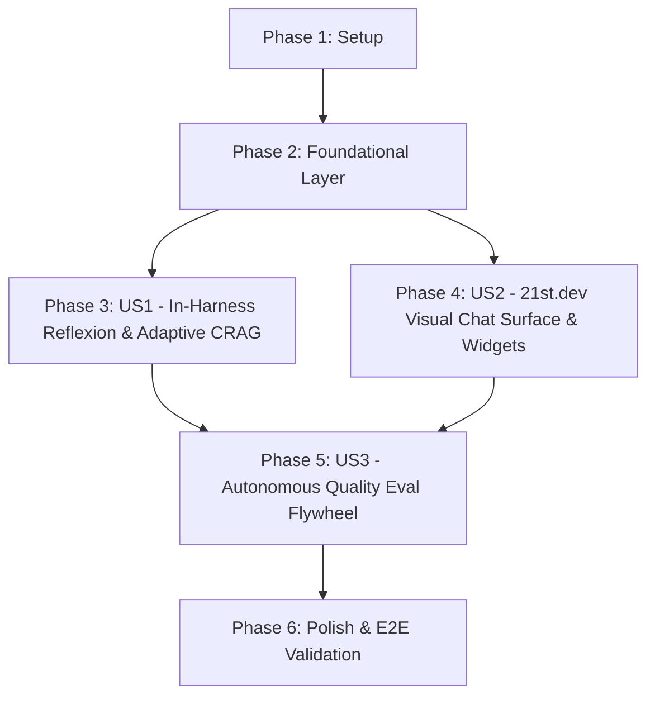

# Tasks: 013-agent-intelligence-chat

**Feature**: Next-Generation Self-Improving Agent Architecture & 21st.dev-Inspired Visual Chat Surface  
**Plan**: [`specs/013-agent-intelligence-chat/plan.md`](file:///Users/abdullahabtahi/RO%20Digital%20Twin/specs/013-agent-intelligence-chat/plan.md)  
**Spec**: [`specs/013-agent-intelligence-chat/spec.md`](file:///Users/abdullahabtahi/RO%20Digital%20Twin/specs/013-agent-intelligence-chat/spec.md)

---

## Dependencies & Execution Order

---

## Phase 1: Setup

- [X] T001 Initialize directory structure for visual chat components at `services/frontend/components/assistant/artifacts/`
- [X] T002 [P] Create evaluation script directory and runner template at `services/agent/eval/`

---

## Phase 2: Foundational Layer (Contracts & BigQuery Schemas)

- [X] T003 [P] Define typed TypeScript interfaces for `ChatMessage`, `ThinkingState`, and `ChatArtifact` in `services/frontend/lib/agent/types.ts`
- [X] T004 [P] Implement BigQuery DDL migration for `ro_serving.agent_traces` in `pipeline/dataform/definitions/serving/agent_traces.sqlx`
- [X] T005 [P] Implement OpenTelemetry / Cloud Trace instrumentation wrapper in `services/frontend/lib/agent/tracing.ts`
- [X] T006 [P] Update Gemini Enterprise Context Caching configuration (`ContextCacheConfig`, TTL 3600s) in `services/frontend/lib/agent/harness.ts`

---

## Phase 3: User Story 1 (P1) — In-Harness Reflexion Critic & Adaptive CRAG

*Goal: Ensure 100% numerical grounding, provenance enforcement, and semantic document retrieval before streaming tokens to the operator.*

- [X] T007 [P] [US1] Unit test: Write test suite for Reflexion critic verifying detection of ungrounded figures in `services/frontend/__tests__/reflexion-critic.test.ts`
- [X] T008 [P] [US1] Unit test: Write test suite for Adaptive CRAG & HyDE query reformulation in `services/frontend/__tests__/crag-grounding.test.ts`
- [X] T009 [US1] Refactor specialist prompt signatures to enforce structured outputs via `responseSchema` in `services/frontend/lib/agent/prompts.ts`
- [X] T010 [US1] Implement BigQuery HyDE query embedding generation in `services/frontend/lib/agent/grounding.ts`
- [X] T011 [US1] Implement CRAG relevance gate ($\text{cosine distance} < 0.12$) with fallback query rewriting in `services/frontend/lib/agent/grounding.ts`
- [X] T012 [US1] Implement lightweight Reflexion Critic pass prior to token emission in `services/frontend/lib/agent/harness.ts`
- [X] T013 [US1] Implement telemetry logging to `ro_serving.agent_traces` on stream completion in `services/frontend/app/api/agent/stream/route.ts`

---

## Phase 4: User Story 2 (P1) — 21st.dev Visual Chat Surface & Interactive Artifacts

*Goal: Deliver a state-of-the-art interactive chat UI with collapsible thinking accordions, embedded sparklines, what-if sliders, and one-click HITL proposal approvals.*

- [X] T014 [P] [US2] Component test: Test `ThinkingAccordion` animation and step-by-step status in `services/frontend/__tests__/thinking-accordion.test.tsx`
- [X] T015 [P] [US2] Component test: Test embedded `SparklineWidget` and `WhatIfWidget` in `services/frontend/__tests__/chat-artifacts.test.tsx`
- [X] T016 [P] [US2] Component test: Test `ProposalCard` HITL approval action and feedback triggers in `services/frontend/__tests__/chat-feedback.test.tsx`
- [X] T017 [US2] Implement animated collapsible `ThinkingAccordion` in `services/frontend/components/assistant/thinking-accordion.tsx`
- [X] T018 [US2] Implement embedded `SparklineWidget` for telemetry trends in `services/frontend/components/assistant/artifacts/sparkline-widget.tsx`
- [X] T019 [US2] Implement embedded `WhatIfWidget` with interactive parameter sliders in `services/frontend/components/assistant/artifacts/what-if-widget.tsx`
- [X] T020 [US2] Implement embedded `ProposalCard` with gated one-click approval button in `services/frontend/components/assistant/artifacts/proposal-card.tsx`
- [X] T021 [US2] Implement `CitationPopover` showing source document snippets in `services/frontend/components/assistant/artifacts/citation-popover.tsx`
- [X] T022 [US2] Implement `MessageBubble` with markdown formatting, copy-to-clipboard, and feedback buttons in `services/frontend/components/assistant/message-bubble.tsx`
- [X] T023 [US2] Implement `FollowUpChips` for contextual action suggestions in `services/frontend/components/assistant/follow-up-chips.tsx`
- [X] T024 [US2] Build modernized glassmorphic `AssistantDrawer` with expandable canvas mode in `services/frontend/components/assistant/assistant-drawer.tsx`
- [X] T025 [US2] Implement feedback ingestion endpoint in `services/frontend/app/api/agent/feedback/route.ts`
- [X] T026 [US2] Implement HITL proposal approval endpoint in `services/frontend/app/api/agent/approve/route.ts`

---

## Phase 5: User Story 3 (P2) — Autonomous Quality Eval Flywheel & Loss Clustering

*Goal: Provide continuous evaluation, error clustering, and textual gradient prompt optimization via Vertex AI Eval SDK.*

- [X] T027 [P] [US3] Create comprehensive 50-case golden benchmark dataset in `services/agent/eval/golden_benchmark_50.json`
- [X] T028 [P] [US3] Implement custom metric evaluators (`grounding`, `hallucination`, `tool_use_quality`) in `services/agent/eval/metrics.py`
- [X] T029 [US3] Implement automated evaluation runner using `agentplatform.evals` in `services/agent/eval/run_eval.py`
- [X] T030 [US3] Implement loss clustering and textual gradient feedback generator in `services/agent/eval/optimize_prompts.py`

---

## Phase 6: Polish, Integration & End-to-End Verification

- [X] T031 Run all Vitest frontend unit and component tests (`npm test` / `vitest run`)
- [X] T032 Run Python evaluation benchmark runner (`python3 services/agent/eval/run_eval.py`)
- [X] T033 Verify responsive glassmorphic chat drawer reflow across mobile and desktop viewports
- [X] T034 Verify live streaming, thinking accordion expansion, sparkline rendering, and HITL decision recording in the browser
